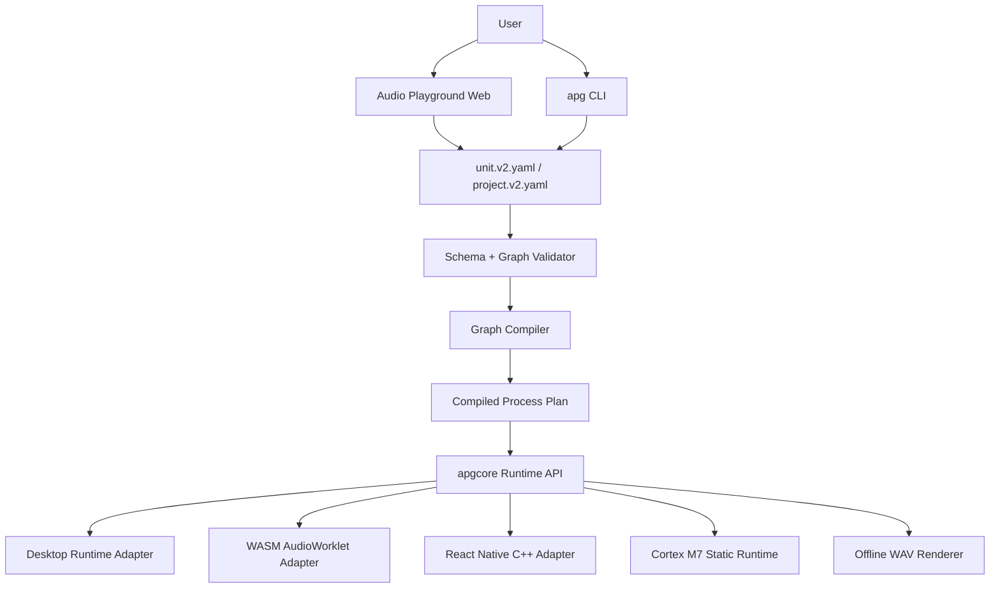
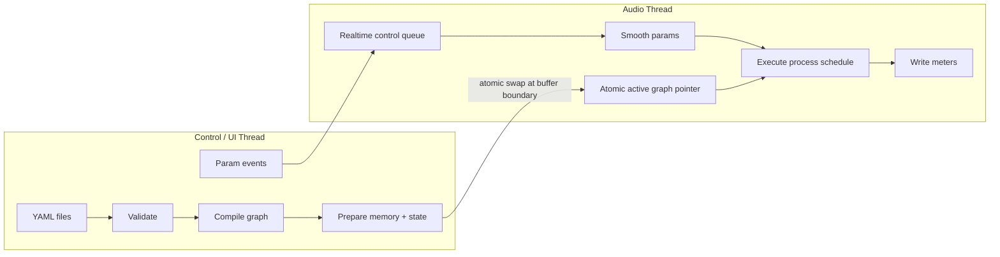
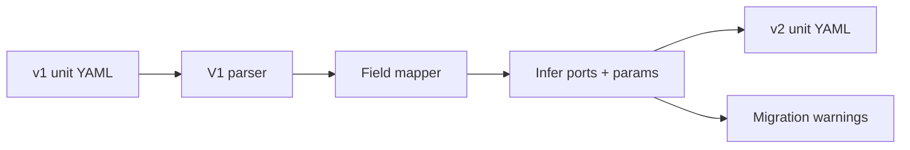
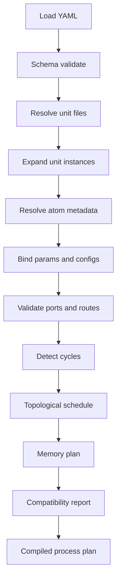
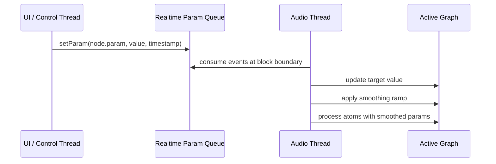
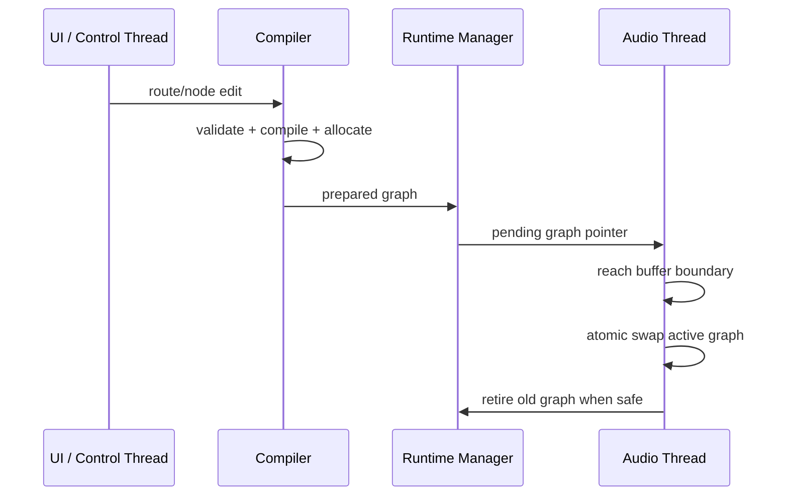
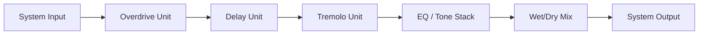

# Audio Playground v2 Technical Design

**Status:** Draft for review  
**Version:** 0.1  
**Date:** 2026-06-27  
**Scope:** Technical design for the Audio Playground v2 upgrade

---

## 1. Design Objective

Audio Playground v2 should keep the existing atom/unit idea while separating product UI, file formats, graph compilation, and realtime DSP execution.

The core architectural move is:

> YAML describes the system. `apgcore` compiles the system. The audio callback only executes a prepared numeric process plan.

---

## 2. Design Principles

| Principle | Design Rule |
|---|---|
| Minimal change | Keep atoms, units, params, signals, and pipelines as the mental model |
| Realtime safety | No heap allocation, locks, YAML parsing, or string lookup in audio callback |
| Portability | Keep `apgcore` free from PipeWire, browser, React Native, and UI dependencies |
| Reuse | Split reusable `unit.v2.yaml` from full-session `project.v2.yaml` |
| High coverage | Use graph compiler, memory planner, validation, and compatibility profiles |
| Determinism | Compile to stable numeric graph and preallocated memory plan |
| Progressive migration | Support current v1 unit format through a compatibility translator |

---

## 3. System Overview



---

## 4. Target Repository Layout

```text
audio-playground/
  apgcore/
    dsp/
      atoms/
      buffers/
      math/
      state/
    graph/
      compiler/
      scheduler/
      validator/
      memory_plan/
    unit/
      schema/
      parser/
      migration/
    runtime_api/
      apg_core.h
      apg_graph.h
      apg_process.h
      apg_params.h
    backends/
      scalar/
      simd_neon/
      simd_sse_avx/
      cmsis_dsp/
      wasm/

  runtimes/
    desktop/
    embedded_m7/
    wasm_audio/
    react_native/

  apps/
    web/
    rn_demo/
    cli/

  examples/
    units/
    projects/
    audio/

  tests/
    atoms/
    graph/
    render_golden/
    schema/
```

### Core boundary

`apgcore` must only know:

```text
graph + params + buffers + process()
```

It must not depend on:

- PipeWire.
- CoreAudio.
- WASAPI.
- Browser APIs.
- React Native.
- File dialogs.
- Web UI state.

---

## 5. Runtime Architecture



### Runtime rules

- YAML parsing happens only on the control thread or offline tools.
- New graphs are compiled and fully prepared before becoming active.
- The audio thread reads only precomputed schedules, buffer pointers, state pointers, and parameter values.
- Graph swaps happen at buffer boundaries.
- Parameter changes use a realtime-safe queue or double-buffered control state.

---

## 6. File Format Design

Audio Playground v2 uses two primary YAML formats.

### 6.1 `unit.v2.yaml`

Reusable DSP building block.

```yaml
kind: apg.unit
schema: apg.unit.v2
name: overdrive
version: 2.0.0

meta:
  title: Overdrive
  category: distortion
  description: Gain, soft clipping, tone filter, and output level.

params:
  drive:
    type: float
    default: 5.0
    min: 0.0
    max: 10.0
    smoothing_ms: 10
    ui:
      label: Drive
      control: knob
  tone:
    type: float
    default: 0.5
    min: 0.0
    max: 1.0
    smoothing_ms: 20
    ui:
      label: Tone
      control: knob
  level:
    type: float
    default: 0.7
    min: 0.0
    max: 1.0
    smoothing_ms: 10
    ui:
      label: Level
      control: knob

ports:
  inputs:
    - name: input
      type: audio
      channels: 1
  outputs:
    - name: output
      type: audio
      channels: 1

graph:
  signals:
    - input
    - output
    - boosted_in
    - clipped_signal
    - toned_signal
    - drive_val
    - level_val

  nodes:
    - id: drive_level
      atom: generation_dc
      out:
        signal: drive_val
      config:
        value: ${params.drive}

    - id: apply_drive
      atom: amplitude_multiply
      in:
        signal_a: input
        signal_b: drive_val
      out:
        signal: boosted_in

    - id: clipper
      atom: amplitude_clip_soft
      in:
        signal: boosted_in
      out:
        signal: clipped_signal
      config:
        threshold: 0.8
        curve: 1

    - id: tone_filter
      atom: filter_biquad
      in:
        signal: clipped_signal
      out:
        signal: toned_signal
      config:
        b0: 0.3
        b1: 0.3
        b2: 0.0
        a1: -0.4
        a2: 0.0

    - id: output_level
      atom: generation_dc
      out:
        signal: level_val
      config:
        value: ${params.level}

    - id: apply_level
      atom: amplitude_multiply
      in:
        signal_a: toned_signal
        signal_b: level_val
      out:
        signal: output

compatibility:
  desktop_full: true
  wasm_realtime: true
  m7_static: true
```

### 6.2 `project.v2.yaml`

Full pedalboard/session file.

```yaml
kind: apg.project
schema: apg.project.v2
name: guitar-board
version: 2.0.0

units:
  - id: overdrive_unit
    file: units/overdrive.yaml
  - id: delay_unit
    file: units/delay.yaml

chain:
  nodes:
    - id: od1
      unit: overdrive_unit
      params:
        drive: 6.0
        tone: 0.55
        level: 0.8
    - id: delay1
      unit: delay_unit
      params:
        time_ms: 360
        feedback: 0.35
        mix: 0.25

  routes:
    - from: system.input
      to: od1.input
    - from: od1.output
      to: delay1.input
    - from: delay1.output
      to: system.output

scenes:
  - name: Clean boost
    params:
      od1.drive: 2.0
      od1.level: 0.9
  - name: Lead
    params:
      od1.drive: 7.5
      delay1.mix: 0.35

automation: []

targets:
  default: desktop_full
  export:
    - wasm_realtime
    - m7_static
```

---

## 7. V1 Migration Design

Current v1 unit files can be translated mechanically.

| v1 field | v2 field |
|---|---|
| `name` | `name` |
| `version` | `version` or `meta.source_version` |
| `params` | `params` with inferred type/range metadata |
| `signals` | `graph.signals` |
| `pipeline[].fn` | `graph.nodes[].atom` |
| `pipeline[].in` | `graph.nodes[].in` |
| `pipeline[].out` | `graph.nodes[].out` |
| `pipeline[].config` | `graph.nodes[].config` |

Migration should produce a valid v2 unit plus warnings for missing UI metadata, parameter ranges, or compatibility flags.



---

## 8. Atom ABI Design

### 8.1 Process info

Replace compile-time block size with runtime metadata.

```c
typedef struct {
  float sample_rate;
  uint32_t frames;
  uint32_t channels;
} apg_process_info_t;
```

### 8.2 Atom process function

```c
typedef void (*apg_atom_process_fn)(
  void* out,
  const void* in,
  const void* params,
  void* state,
  const apg_process_info_t* info
);
```

### 8.3 Atom descriptor

```c
typedef enum {
  APG_PORT_AUDIO,
  APG_PORT_CONTROL,
  APG_PORT_BUFFER,
  APG_PORT_SPECTRUM_REAL,
  APG_PORT_SPECTRUM_IMAG
} apg_port_type_t;

typedef struct {
  const char* name;
  apg_port_type_t type;
  uint32_t channels;
  uint32_t required;
} apg_port_desc_t;

typedef struct {
  const char* name;
  uint32_t type;
  float default_value;
  float min_value;
  float max_value;
} apg_config_desc_t;

typedef struct {
  uint32_t id;
  const char* name;
  const char* category;

  const apg_port_desc_t* inputs;
  uint32_t input_count;

  const apg_port_desc_t* outputs;
  uint32_t output_count;

  const apg_config_desc_t* configs;
  uint32_t config_count;

  uint32_t params_size;
  uint32_t state_size;
  uint32_t flags;

  apg_atom_process_fn process;
} apg_atom_desc_t;
```

### 8.4 Atom process rules

Each atom must:

- Use `info->frames` for sample loops.
- Use `info->sample_rate` unless config explicitly overrides it.
- Treat input/output pointers as prevalidated but still guard against null where practical.
- Read/write only its assigned state block.
- Avoid allocation, locks, logging, file I/O, and string lookup.
- Declare any fixed block-size constraints in metadata.

### 8.5 Example atom loop migration

Current pattern:

```c
for (int i = 0; i < CHUNK_LENGTH; ++i) {
  out->signal[i] = in->signal_a[i] * in->signal_b[i];
}
```

Target pattern:

```c
for (uint32_t i = 0; i < info->frames; ++i) {
  out->signal[i] = in->signal_a[i] * in->signal_b[i];
}
```

---

## 9. Graph Compiler Design

### 9.1 Compiler stages



### 9.2 Compiler output

```c
typedef struct {
  uint32_t node_count;
  apg_compiled_node_t* nodes;

  uint32_t schedule_count;
  uint32_t* schedule;

  apg_memory_plan_t memory;
  apg_param_table_t params;
  apg_meter_plan_t meters;
  apg_compat_report_t compatibility;
} apg_compiled_graph_t;
```

### 9.3 Compiled node

```c
typedef struct {
  uint32_t node_id;
  uint32_t atom_id;

  void* in_ptrs;
  void* out_ptrs;
  void* params_ptr;
  void* state_ptr;

  uint32_t flags;
} apg_compiled_node_t;
```

### 9.4 Compile error model

```c
typedef struct {
  const char* code;
  const char* message;
  const char* file;
  const char* path;
  uint32_t severity;
} apg_error_t;
```

Example errors:

| Code | Meaning |
|---|---|
| `APG_SCHEMA_MISSING_FIELD` | Required YAML field missing |
| `APG_ATOM_UNKNOWN` | Atom name not found in registry |
| `APG_PORT_MISMATCH` | Route connects incompatible port types |
| `APG_GRAPH_CYCLE` | Graph has unsupported cycle |
| `APG_PARAM_OUT_OF_RANGE` | Parameter value outside range |
| `APG_BACKEND_UNSUPPORTED_ATOM` | Atom not available for target backend |

---

## 10. Scheduler Design

The scheduler computes a stable topological process order.

Rules:

- Stateless and stateful atoms are both scheduled as nodes.
- Edges define signal dependencies.
- Feedback requires explicit delay/stateful atoms. Direct zero-delay cycles are invalid unless supported by a future solver.
- Schedule is immutable once compiled.

Pseudo-code:

```text
build dependency graph from node inputs/outputs
for each route:
  add edge producer_node -> consumer_node
check for invalid cycles
schedule = topological_sort(graph)
return schedule
```

---

## 11. Memory Planner Design

### 11.1 Goals

- Preallocate signal buffers.
- Preallocate atom state.
- Reuse temporary buffers where lifetimes do not overlap.
- Produce static layout for embedded export.

### 11.2 Memory regions

| Region | Purpose | Allocation time |
|---|---|---|
| Audio input/output buffers | System I/O | Runtime open |
| Internal signal buffers | Edges and intermediate signals | Graph prepare |
| Atom state blocks | Stateful DSP state | Graph prepare |
| Parameter blocks | Current values and smoothing state | Graph prepare |
| Meter buffers | UI-safe metering snapshots | Runtime prepare |

### 11.3 Embedded memory plan

For Cortex M7, the compiler emits:

- Static node table.
- Static schedule table.
- Static buffer offsets.
- Static state offsets.
- Static parameter table.
- Compatibility report.

No YAML parser is required on device.

---

## 12. Runtime Processing Design

### 12.1 Process API

```c
typedef struct apg_runtime_graph apg_runtime_graph_t;

void apg_process(
  apg_runtime_graph_t* graph,
  float** inputs,
  float** outputs,
  const apg_process_info_t* info
);
```

### 12.2 Processing loop

```text
consume pending parameter events
update smoothed parameter values
for node_id in compiled_graph.schedule:
  node = compiled_graph.nodes[node_id]
  atom = atom_registry[node.atom_id]
  atom.process(node.out_ptrs, node.in_ptrs, node.params_ptr, node.state_ptr, info)
write meters to UI-safe meter snapshot
```

### 12.3 Parameter update flow



---

## 13. Hot Graph Swap Design

Graph changes are structural changes. They must not modify the active process plan in place.



Rules:

- Invalid graph never replaces active graph.
- Old graph remains valid until audio thread has stopped referencing it.
- Graph swap can optionally crossfade outputs to avoid clicks.

---

## 14. Runtime Adapters

### 14.1 Desktop adapter

The desktop adapter owns audio device I/O and calls `apg_process()`.

```cpp
class AudioDeviceBackend {
public:
  virtual bool open(const AudioDeviceConfig& config) = 0;
  virtual void close() = 0;
  virtual bool start(AudioCallback* callback) = 0;
};
```

Initial backend priority:

| Platform | Adapter |
|---|---|
| Linux | PipeWire first, JACK optional |
| macOS | CoreAudio or JUCE adapter |
| Windows | WASAPI or JUCE adapter |
| CLI | WAV input/output |

### 14.2 Browser adapter

Browser runtime uses:

```text
apgcore C++ → WASM → AudioWorkletProcessor
```

Rules:

- UI thread sends control messages only.
- Audio processing happens in the AudioWorklet path.
- No per-sample audio buffers are sent through React/main JS.

### 14.3 React Native adapter

React Native controls the engine through C++ bindings.

Required API shape:

```cpp
loadProject(path_or_blob)
compileGraph(project_id)
setParam(node_id, param_id, value)
setBypass(node_id, enabled)
getMeter(node_id)
```

Rules:

- JavaScript controls parameters and project state.
- Native C++ processes audio.
- Audio buffers are not passed through JavaScript.

### 14.4 Cortex M7 adapter

Embedded runtime uses offline compiled bundles.

```text
project YAML
  → host compiler
  → static graph bundle
  → firmware includes bundle
  → apg_process_static()
```

Rules:

- No runtime YAML parser required.
- No heap allocation in process callback.
- Atom subset is restricted and declared by `m7_static` profile.

---

## 15. Backend Compatibility Profiles

| Feature | `desktop_full` | `wasm_realtime` | `m7_static` | `offline_render` |
|---|---:|---:|---:|---:|
| Dynamic graph load | Yes | Yes | No | Yes |
| Hot graph swap | Yes | Yes | Limited | N/A |
| YAML parsing at runtime | Yes, control thread | Yes, control thread | No | Yes |
| Heap in audio callback | No | No | No | N/A |
| Full atom catalog | Yes | Partial | Restricted | Yes |
| FFT atoms | Yes | Limited | Usually no/limited | Yes |
| Long delay buffers | Yes | Limited by memory | Strictly bounded | Yes |
| SIMD/CMSIS optimization | Optional | WASM SIMD optional | CMSIS-DSP optional | Optional |

---

## 16. Web App Design

### 16.1 Required screens

| Screen | Primary responsibility |
|---|---|
| Project browser | Manage local projects, imports, exports, autosave |
| Pedalboard canvas | Unit-level composition and routing |
| Unit editor | Atom-level graph editing inside a selected unit |
| Parameter panel | Public controls, ranges, smoothing, UI metadata |
| Live preview | Start/stop audio and select input/output |
| Inspector | Errors, warnings, CPU estimate, memory estimate, compatibility |
| Export panel | Build target bundles |

### 16.2 UX rule

Users should be able to work at two depths:

1. **Pedalboard level:** Add and connect units.
2. **Unit internals level:** Edit atom graph inside a unit.

Default workflow should start at pedalboard level, not atom-level internals.

---

## 17. CLI Design

Required commands:

```bash
apg validate units/overdrive.yaml
apg validate projects/guitar-board.yaml
apg render projects/guitar-board.yaml input.wav output.wav
apg benchmark projects/guitar-board.yaml
apg export --target wasm_realtime projects/guitar-board.yaml dist/web/
apg export --target m7_static projects/guitar-board.yaml build/m7/
```

Validation output example:

```json
{
  "ok": false,
  "errors": [
    {
      "code": "APG_ATOM_UNKNOWN",
      "path": "graph.nodes[3].atom",
      "message": "Unknown atom 'filter_biquadd'. Did you mean 'filter_biquad'?"
    }
  ],
  "warnings": []
}
```

---

## 18. Testing Strategy

### 18.1 Atom tests

- Process each atom with multiple frame sizes.
- Verify null-guard behavior where applicable.
- Verify state continuity across blocks.
- Verify deterministic output for known input vectors.

### 18.2 Graph compiler tests

- Valid single-unit graph.
- Valid multi-unit project.
- Missing atom.
- Invalid config field.
- Port mismatch.
- Unsupported cycle.
- Buffer lifetime reuse.
- Backend compatibility failure.

### 18.3 Runtime tests

- No allocation in audio callback for supported path.
- Parameter smoothing regression tests.
- Hot graph swap safety tests.
- Meter snapshot tests.
- Offline render golden-output tests.

### 18.4 Platform tests

| Platform | Test |
|---|---|
| Desktop | Open device, process graph, change params live |
| Browser | Load WASM engine, play sample project through worklet |
| React Native | Compile project and update params through native binding |
| Cortex M7 | Compile static bundle and verify memory limits |
| CLI | Validate/render/benchmark/export in CI |

---

## 19. Implementation Roadmap

### Phase 0 — Stabilize foundation

- Create `apgcore` module boundary.
- Add atom metadata registry.
- Add `apg_process_info_t`.
- Port first atoms away from `CHUNK_LENGTH`.
- Add CLI `validate` and `render` skeleton.

### Phase 1 — Graph compiler

- Add `unit.v2.yaml` schema.
- Add `project.v2.yaml` schema.
- Build parser, validator, compiler, scheduler, and memory planner.
- Add v1 → v2 migration path.

### Phase 2 — Live runtime

- Add realtime parameter queue.
- Add smoothing.
- Add hot graph swap.
- Add metering.
- Add bypass/mute/solo.

### Phase 3 — Web app v2

- Add multi-file project model.
- Add local autosave.
- Add visual pedalboard canvas.
- Add unit graph editor.
- Add inspector.
- Add WASM live preview.

### Phase 4 — Platform expansion

- Linux desktop adapter.
- Browser AudioWorklet adapter.
- React Native C++ adapter.
- Cortex M7 static bundle export.

### Phase 5 — Product layer

- Built-in unit library.
- Presets and scenes.
- Sharing/export workflow.
- Benchmark mode.
- Compatibility matrix UI.

---

## 20. First Reference Implementation Path

Implement the first end-to-end slice with guitar pedalboard effects.



Why this path:

- Overdrive validates current v1 unit migration.
- Delay validates stateful buffers.
- Tremolo validates LFO and modulation.
- EQ validates filters.
- Wet/dry mix validates routing and UX.
- Noise gate can be added next to validate detect/control behavior.

---

## 21. Open Technical Questions

| Question | Recommendation |
|---|---|
| Should `chain.yaml` be separate from `project.yaml`? | Use `project.v2.yaml` as primary; allow `chain.v2.yaml` alias for pedalboard-only projects |
| Should graph cycles be allowed? | Disallow zero-delay cycles in MVP; require explicit delay/feedback atoms |
| Should FFT atoms be in M7 MVP? | Exclude initially unless memory budget proves safe |
| Should JUCE be inside `apgcore`? | No; use only as optional adapter |
| Should YAML be parsed on M7? | No; compile offline to static bundle |
| Should UI call atoms directly? | No; UI edits files/graph model and calls compiler/runtime APIs |

---

## 22. Next Review Step

The next review step should be:

> Approve the requirements/design direction, then define the exact v2 unit/project parameter schema before creating any new `unit.yaml` files.
