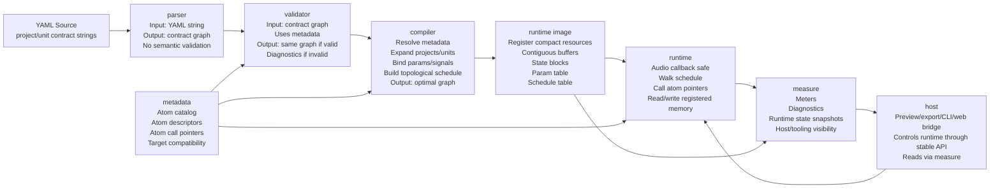

I would define the layers like this:

```
   Layer            Input                                  Output                         Scope
  ━━━━━━━━━━━━━━━  ━━━━━━━━━━━━━━━━━━━━━━━━━━━━━━━━━━━━━  ━━━━━━━━━━━━━━━━━━━━━━━━━━━━━  ━━━━━━━━━━━━━━━━━━━━━━━━━━━━━━━━━━━━━━━━━━━━━
   metadata         compiled-in atom table                 descriptors + call pointers    isolated reference module
  ───────────────  ─────────────────────────────────────  ─────────────────────────────  ─────────────────────────────────────────────
   parser           YAML string                            raw contract graph             syntax/shape only, no semantic validation
  ───────────────  ─────────────────────────────────────  ─────────────────────────────  ─────────────────────────────────────────────
   validator        raw graph + metadata                   same graph or diagnostics      semantic checks
  ───────────────  ─────────────────────────────────────  ─────────────────────────────  ─────────────────────────────────────────────
   compiler         validated graph + metadata             optimized graph / plan         expansion, binding, schedule
  ───────────────  ─────────────────────────────────────  ─────────────────────────────  ─────────────────────────────────────────────
   runtime image    optimized graph                        compact execution memory       contiguous buffers, params, state, schedule
  ───────────────  ─────────────────────────────────────  ─────────────────────────────  ─────────────────────────────────────────────
   runtime          runtime image + audio/control input    audio/control output           real-time execution only
  ───────────────  ─────────────────────────────────────  ─────────────────────────────  ─────────────────────────────────────────────
   measure          runtime/runtime image state            host-facing snapshots          meters, diagnostics, readiness
  ───────────────  ─────────────────────────────────────  ─────────────────────────────  ─────────────────────────────────────────────
   host             app/CLI/web calls                      user-facing behavior           orchestration, not DSP logic

```

The main correction to the current codebase is that several layers are mixed:

- unit_v2.c / project_v2.c currently do parsing and validation.
- compiler_v2.c compiles, but runtime memory layout still happens mostly inside runtime_v2.c.
- runtime_v2.c owns execution, controls, bypass, meters, and some host-facing state.
- atom_catalog / atom_register are close to your metadata idea and should stay isolated.

So the next design target should be:

YAML string
  -> parser: contract graph
  -> validator: validated contract graph
  -> compiler: optimized graph/plan
  -> runtime image builder: compact memory + schedule
  -> runtime: execute only
  -> measure: expose state to host/tooling

This direction also fits STM32H7 better because the runtime can eventually receive a prebuilt static image instead of allocating and resolving at startup.