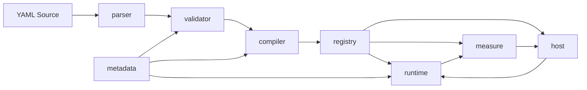

# Unit v2 Compiler Architecture

`core-design.md` is the current production module-boundary target: metadata, parser, validator, compiler, registry, runtime, measure, and host.

## Production Module Flow

## Parser and Validator

`apg_v2_parse_file(...)` and `apg_v2_parse_string(...)` parse YAML into a raw arena-owned `uc_node` contract graph without semantic validation. Unit and project validators then fill `apg_unit_v2_t` or `apg_project_v2_t` and validate schema rules, atom metadata references, graph names, binding keys, compatibility flags, and `${params.name}` references.

The public loaders remain thin compatibility entry points that run parser then validator. They preserve string values in the caller-provided arena and do not allocate runtime buffers or resolve signal indexes.

For production DSP execution, parser/validator/compiler/registry stages are intentionally out of the real-time path: runtime initialization and `apg_v2_runtime_process_*` operate only on prebuilt metadata and immutable schedules.

## Compiler Plan

`apg_v2_compile_unit(...)` lowers `apg_unit_v2_t` into `apg_v2_compiled_unit_t`:

- resolves atom registry entries per node;
- converts signal bindings into signal indexes;
- converts config bindings into param indexes or literal values;
- validates required atom binding keys for the MVP atom set;
- records `signal_producers[signal_index]` for runtime lookup;
- emits a schedule of node indexes.

Compile errors include node IDs, binding sections, and binding keys where available so fixture failures point at the source graph entry.

## Scheduling

The compiler treats public audio inputs as initially available, then repeatedly schedules nodes whose signal inputs are available. Forward references are allowed when a later node produces the needed signal. Unresolved dependencies and direct cycles fail compilation.

This scheduling step guarantees a fixed, validated execution order before any audio callback or render call starts.

## Runtime MVP

`apg_v2_registry_build(...)` is declared by `registry_builder_v2.h` and creates an arena-owned registry descriptor from a compiled plan. The consumer type in `registry_v2.h` does not include compiler plan definitions. The builder precomputes signal name maps, param defaults, smoothing frames, meter, public audio port maps, bypass/project-mute metadata, per-node atom storage offsets, copied schedule view, state-buffer count/capacity/offsets, signal-array pointer-pool sizing, scalar refresh plans, copied signal-array indexes, and control-target layout metadata without allocating audio/runtime buffers. Scalar literal text is parsed by the compiler before runtime, and scalar refresh field/key validation stops at registry build.

`apg_v2_runtime_init_from_registry(...)` creates an opaque `apg_v2_runtime_t` from that descriptor. The runtime owns contiguous signal and parameter pools, registry-derived index/control metadata, and internal per-node `atom_call_t` storage, but not the source compiled-plan pointer or registry arena. Runtime nodes execute atom thunks and labels copied from the registry. Public runtime headers expose only the runtime handle and index-based control/process APIs; runtime layout lives in `runtime_v2_internal.h`. Signal buffers are exposed by compiled index through `apg_v2_runtime_signal_buffer_at(...)` and `apg_v2_runtime_signal_buffer_at_mut(...)`. `apg_v2_runtime_set_param_index(...)`, `apg_v2_runtime_set_control_port_index(...)`, `apg_v2_runtime_set_instance_bypass_index(...)`, `apg_v2_runtime_process_mono_port_indices(...)`, and `apg_v2_runtime_process_interleaved_port_indices(...)` are the real-time-friendly entry points: hosts resolve names outside runtime, then use compiled indices in the audio loop. `apg_v2_runtime_reset(...)` clears signal buffers, restores registry-derived param defaults, and resets state storage while preserving internal buffer pointers. Processing refreshes scalar bindings, executes the registry schedule through atom thunks, applies project mute, and copies indexed external buffers when requested. Meter snapshots are produced by `apg_v2_measure_*` from runtime signal buffers.

`apg_v2_measure_*` APIs expose host/tooling reads for runtime snapshots, meter snapshots, and diagnostics. There are no remaining runtime read wrappers for these paths; callers use `measure_v2` directly. See `docs/APGCORE_BOUNDARY_AUDIT.md` for the current production boundary audit.

## Memory Ownership

The loader and compiler write all parsed unit data, binding arrays, schedules, and producer maps into the caller-provided `uc_arena`. The compiled plan borrows the loaded unit pointer, so the arena must outlive both `apg_unit_v2_t` and `apg_v2_compiled_unit_t`. Treat loaded units and compiled plans as immutable once a runtime has been initialized from them.

The registry does not store the compiled-plan pointer. It owns arena-allocated metadata/default/layout tables and copies schedule/name pointer tables while borrowing immutable source strings. The runtime borrows registry-derived index metadata and owns only its mutable allocations: signal pool, signal pointer table, parameter/default/target values, bypass state flags, one contiguous atom storage pool, and one contiguous state-buffer pool. Runtime signal-buffer APIs return pointers by compiled index; callers must not free them and must stop using them after `apg_v2_runtime_destroy(...)`. Destroying a runtime frees only runtime-owned memory and does not free the registry arena. Public host structs keep runtime ownership behind pointers so callers cannot mutate runtime layout directly.

Current limits: control ports update params only, atom in/out fields are bound by compiled binding order, and state allocation currently covers `FIELD_BUFFER` descriptors with atom-declared capacities. The v1 runtime/unit/YAML paths are legacy; see `docs/V1_DEPRECATION_AUDIT.md` before removing anything.

Schema names in CLI fixture outputs such as `apg.unit.inspect.v2` and `apg.project.render.v2` are protocol identifiers only; they do not indicate runtime re-use of a legacy v1 execution path.

For STM32H7/M7 deployment boundaries, see `docs/STM32H7_M7_BOARD_INTEGRATION.md`.
